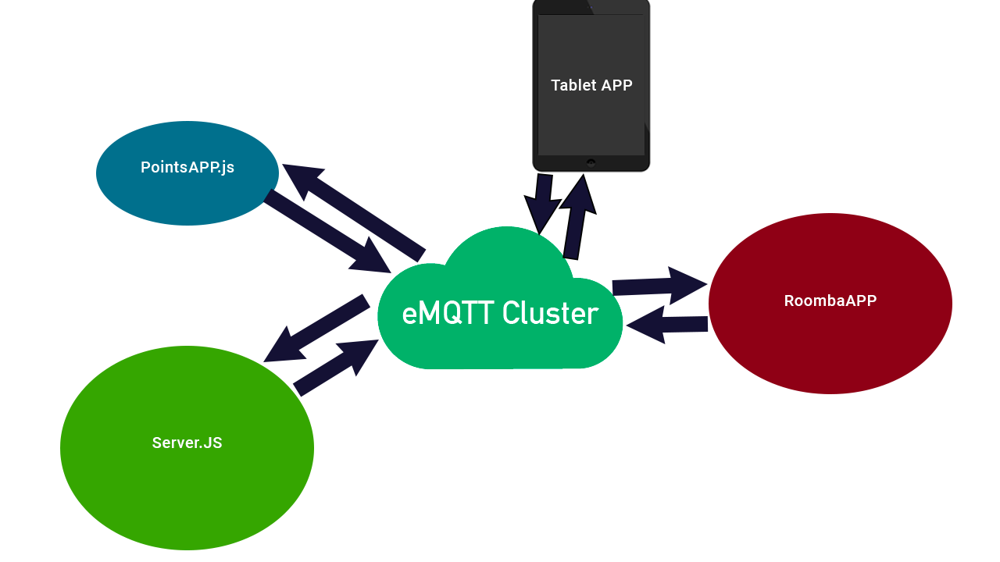

# Documentation projet CrazyRoomba
## Présentation du projet
Le projet CrazyRoomba est un projet permettant de transformer la plateforme iCreate (v1) de iRobot en un robot compagnon connecté. Nous avons également intégrer un système permettant de récuperer la position du robot par rapport à sa position de départ.<br/>
Le système repose entièrement sur le protocol MQTT pour l'échange des données entre les differentes parties du projet et possiblement avec d'autres objets connectés.

## Le matériel utilisé
Le projet repose en plus de la plateforme iCreate sur un raspberry pi pour gérer la récuperation et l'envoie de données au robot. Il utilise également une tablette pour permettre un affichage directement sur le robot ainsi que la récupération de l'angle (l'angle donné par la plateforme iCreate n'étant pas assez précis).<br/>
Pour ce projet, le matériel qui a été utilisé est le suivant:
<ul>
<li>Gigabyte Tegra note 7</li>
<li>Raspberry Pi 3 sous Raspbian</li>
<li>Plateforme robotique iRobot iCreate 1</li>
<li>PowerBank pour l'alimentation de la tablette et du Pi</li>
</ul>

# Logiciel et frameworks utilisés
## Logiciels
### emqtt.io
Le projet est conçu autour du protocol MQTT. Pour le faire fonctionner, il vous faudra donc un broker MQTT fonctionnel. Nous avons fait le choix de <a href="http://emqtt.io/">emqtt.io</a> qui est un broker écrit en erLang et permet d'effectuer une infrastructure distribuée très facilement. Il permet de gérer 4000 messages par secondes en entrée et 20000 messages par seconde en sortie par noeuds (<a href="https://github.com/emqtt/emqttd/wiki/benchmark-for-0.13.0-release">sources</a>). Il implémente le protocol MQTT V3.1.1 supporte à la fois une connexion directement via le protocole MQTT(port 1083 par défaut) ou via Websocket (port 8083 par défaut).

## Frameworks et bibliothèques
### Frameworks
Le projet se base principalement sur le framework <b>Angular</b>. Il a donc été développé principalement en typeScript. Nous avons également utilisé nodeJs pour la partie serveur se trouvant sur le raspberry pi. <br/>
<b>Ionic</b> a aussi été utilisé (lui-même basé sur <b>Angular</b>) pour créer l'application tablette. 
### Bibliothèques
<ul>
<li>MQTTjs</li>
<li>Serialport (pour nodeJS)</li>
</ul>

## Découpage du projet
Grâce a sa conception autour du protocol MQTT, nous avons pu découper facilement l'ensemble de notre projet en plusieurs applications.

### Les trois grandes parties de l'application sont:
#### Application Server.js
C'est l'application qui va communiquer directement avec le robot. C'est elle qui va récuperer les différentes données des capteurs. Elle va également envoyer des commandes au robot. Elle utilise la librairie serialport.

#### Apllication RoombaAPP
C'est l'application qui tourne sur un client web. Elle se connecte à l'application Server.js via le broker MQTT.
#### Application PointsAPP
C'est l'application qui permet la localisation aproximative du robot en fonction de son point de départ.

#### Application TabletAPP
C'est l'application qui tourne sur la tablette associée au robot. Elle permet d'envoyer l'angle à l'application PointsAPP et également un affichage sur le robot.

## Organisation des dossiers
`/` contient tous les fichiers concernant le serveur notamment le point d'entrée: `server.js` <br/>
`config`contiens le fichier de configuration <br/>
`pointsApp`contiens l'application PointsApp <br/>
`roomba-app`contiens l'application Angular RoombaAPP<br/>
`roomba-app/jsLibrairies` est appelé sur `http://localhost:3000/librairies`. C'est ici que sont stockées les bibliothèques javascript pour la partie client (notamment robot.js version client).<br/>
`tabletApp/` ici ce trouve le code source de l'application tablette utilisant le framework Ionic

## Fonctionnement de eMQTT.io
### Principe de base
MQTT est un protocole basé sur le mécanisme de "publish"/"subscribe". 
On s'abonne à un évenement afin de pouvoir en être notifié. Et on publie afin de notifier les abonnés.
### Clusteriser emqtt.io
L'un des objectifs du projet était de créer un cluster (infra distribuée). Emqtt.io possède déjà cette possibilité. Pour cela il suffit de modifier le nom de noeud dans `/etc/emq.conf` et changer la valeur de `node.name` comme : `node.name = emq@192.168.0.10` par exemple.
Ensuite pour joindre une instance (attention à l'ouverture de vos ports dans le parefeu) il suffit de taper la commande  `./bin/emqttd_ctl cluster join emq@192.168.0.10` par exemple. Dans ce cas, l'instance sur laquelle vous exécutez la commande va être mise en cluster avec `emq@192.168.0.10`. Elles vont travailler ensemble.

## Installation du projet:
Il faudra tout d'abord installer angular-cli. Et également ionic pour pouvoir compiler l'application android de la tablette. <br/>
Il vous faudra également une instance de emqtt.io. Je vous conseille d'utiliser le bash pour ubuntu si vous êtes sous windows car cela rendra les choses plus simples pour la suite. Ensuite il vous faudra cloner le dépot github et installer tous les plugins nécessaires à son fonctionnement grâce à cette commande:
`git clone https://github.com/bloudman/CrazyRoomba.git && cd CrazyRoobma && npm run setup` <br/>
Ensuite vous pouvez taper la commande: `npm start` pour le lancer .<br/>
Si vous voulez juste lancer le serveur: 
`npm run serve` <br/>
Si vous voulez juste compiler l'application angular: 
`npm run build` <br/>

## Configuration
Il existe un fichier de configuration dans le projet. Il se trouve dans: `config/config.js`. 
Ce fichier comporte le port série à utiliser avec le robot et l'addresse IP du broker MQTT+son port websocket à utiliser pour toutes les applications (sauf l'application de la tablette) ou vous pouvez bien sûr changer manuellement l'ip dans toutes les applications plutôt que d'utiliser celle de config.js.

## Server.js
C'est dans ce fichier que se trouve la déclaration du serveur web express.js. Il gère également la connexion avec le broker mqtt. Il appelle la classe robot.js (version serveur).

## Robot.js
Il y a 2 classes Robot.js dans ce projet : l'une est utilisée par le serveur et est située à la racine et l'autre est utilisée par le client et est stockée dans `roomba-app/jsLibrairies` 
### Coté serveur
Il s'agit de la classe qui gère la connexion avec le robot. Le robot parle via une communication série. La classe agit donc comme une interface qui peut être utilisée directement en js ou via le broker 
### Coté client
Il permet d'utiliser les mêmes méthodes en apparence que sur le coté serveur.
### Les méthodes de Robot.js (version serveur/client)
#### `_sendCommand(buffer)`
Send a buffer command to the robot
***
#### `passiveMode()`
Put roomba in passiveMode
***
#### `safeMode()`
Put roomba in safeMode
***
#### `fullMode()`
Put roomba in fullMode
***
#### `sing(notes)`
***
#### `drive(velocity, radius, direct=false)`
***
#### `driveDirect(leftMotor, rightMotor)`
***
#### `stop()`
Stop roomba's motors and the demo
#### `startDemo(number)`
***
#### `setLED(number, color, intensity)`
***
#### `setDigitalOuputPort(value)`
***
#### `setDigitalOutputPin(pin, state)`
***
#### `getDigitalOutputPort()`
***
#### `getDigitalOutputState(pin)`
***
#### `setPWLLowSideDrivers(driver1, driver2, driver3)`
***
#### `streamSensors(ids)`
Ask roomba to stream you sensors
***
#### `streamAllSensors()`
Ask roomba to stream you all of his sensors
***
#### `pauseStreaming()`
Pause the streaming
***
#### `resumeStreaming()`
Resume streaming after pause
***
#### `wait(time)`
***
#### `waitDistance(distance)`
***
#### `waitAngle(angle)`
***
#### `waitEvent(event)`
***

### Ce que Robot.js prend en charge:
#### Les capteurs:
<table>
	<tr>
	<th>SensorName</th>
	<th>ID</th>
	<th>Unit</th>
	</tr>
	<tr><td>BumpsAndWheelDrops</td> <td>7</td> <td></td> </tr>
	<tr><td>CliffLeft</td> <td>8</td> <td></td> </tr>
	<tr><td>CliffFrontLeft</td> <td>10</td> <td></td> </tr>
	<tr><td>CliffFrontRight</td> <td>11</td> <td></td> </tr>
	<tr><td>CliffRight</td> <td>12</td> <td></td> </tr>
	<tr><td>VirtualWall</td> <td>13</td> <td></td> </tr>
	<tr><td>Overcurrents</td> <td>14</td> <td></td> </tr>
	<tr><td>IRByte</td> <td>17</td> <td></td></tr>
	<tr><td>Buttons</td> <td>18</td> <td></td></tr>
	<tr><td>Distance</td> <td>19</td> <td>mm</td></tr>
	<tr><td>Angle</td> <td>20</td> <td>mm</td></tr>
	<tr><td>ChargingState</td> <td>21</td> <td></td></tr>
	<tr><td>Voltage</td> <td>22</td> <td></td> </tr>
	<tr><td>Current</td> <td>23</td> <td></td> </tr>
	<tr><td>BatteryTemperature</td><td>24</td> <td></td></tr>
	<tr><td>BatteryCharge</td><td>25</td><td></td></tr>
	<tr><td>BatteryCapacity</td><td>26</td><td></td></tr>
	<tr><td>WallSignal</td><td>27</td><td></td></tr>
	<tr><td>CliffLeftSignal</td><td>28</td><td></td></tr>
	<tr><td>CliffFrontLeftSignal</td><td>29</td><td></td></tr>
	<tr><td>CliffFrontRightSignal</td><td>30</td><td></td></tr>
	<tr><td>CliffRightSignal</td><td>31</td><td></td></tr>
	<tr><td>UserDigitalInputs</td><td>32</td><td></td></tr>
	<tr><td>UserAnalogInputs</td><td>33</td><td></td></tr>
	<tr><td>ChargingSourcesAvailable</td><td>34</td><td></td></tr>
	<tr><td>OIMode</td><td>35</td><td></td></tr>
	<tr><td>SongNumber</td><td>36</td><td></td></tr>
	<tr><td>SongPlaying</td><td>37</td><td></td></tr>
	<tr><td>NumberOfStreamPackets</td><td>38</td><td></td></tr>
	<tr><td>Velocity</td><td>39</td><td></td></tr>
	<tr><td>Radius</td><td>40</td><td></td></tr>
	<tr><td>RightVelocity</td><td>41</td><td></td></tr>
	<tr><td>LeftVelocity</td><td>42</td><td></td></tr>
</table>

#### Evènements du robot:
<table>
	<tr><th>EventName</th><th>Id</th></tr>
	<tr><td>wheel-drop</td><td>1</td></tr>
	<tr><td>front-wheel-drop</td><td>2</td></tr>
	<tr><td>left-wheel-drop</td><td>3</td></tr>
	<tr><td>right-wheel-drop</td><td>4</td></tr>
	<tr><td>bump</td><td>5</td></tr>
	<tr><td>left-bump</td><td>6</td></tr>
	<tr><td>right-bump</td><td>7</td></tr>
	<tr><td>virtual-wall</td><td>8</td></tr>
	<tr><td>wall</td><td>9</td></tr>
	<tr><td>cliff</td><td>10</td></tr>
	<tr><td>left-cliff</td><td>11</td></tr>
	<tr><td>front-left-cliff</td><td>12</tr><tr>
	<tr><td>front-right-cliff</td><td>13</td></tr>
	<tr><td>right-cliff</td><td>14</td></tr>
	<tr><td>home-base</td><td>15</td></tr>
	<tr><td>advance-button</td><td>16</td></tr>
	<tr><td>play-button</td><td>17</td></tr>
	<tr><td>digital-output-0</td><td>18</td></tr>
	<tr><td>digital-output-1</td><td>19</td></tr>
	<tr><td>digital-output-2</td><td>20</td></tr>
	<tr><td>digital-output-3</td><td>21</td></tr>
	<tr><td>passive</td><td>22</td></tr>
</table>

#### Différentes démos:
<table>
	<tr><th>DemoName</th><th>Id</th></tr>
	<tr><td>abort</td><td>255</td></tr>
	<tr><td>cover</td><td>0</td></tr>
	<tr><td>cover-and-dock</td><td>1</td></tr>
	<tr><td>spot-cover</td><td>2</td></tr>
	<tr><td>mouse</td><td>3</td></tr>
	<tr><td>drive-figure-eight</td><td>4</tr>
	<tr><td>wimp</td><td>5</td></tr>
	<tr><td>home</td><td>6</td></tr>
	<tr><td>tag</td><td>7</td></tr>
	<tr><td>pachelbel</td><td>8</td></tr>
	<tr><td>banjo</td><td>9</td></tr>
</table>


### Evènements de la librairie
Cette classe est basée sur EventEmitter (côté client et côté serveur). Vous pouvez récuperer un évenement comme ceci:

```js
roomba.on('event', function(data){
	console.log(data);
});
```
### Côté client et serveur:
#### `connected`
Est déclenché lorsque le robot est connecté.
***
#### `datas`
Récupere le tableau de données de tous les capteurs demandés (via streamSensors) toutes les 50ms (par défaut, voir changeEmission pour le modifier).
***
### Côté serveur uniquement
#### `data`
Donnée d'un seul capteur à la fois.
***
#### `errordata`
Le checksum de la dernière donnée remontée est incorrect.
***
#### `packetNotFound`
La donnée reçue ne correspond à aucun capteur de la liste. On ne la prend pas en compte car elle est incorrecte.

### Que se passe-t-il lorsque le robot est mal connecté ? 
Lorsque le robot n'est pas correctement connecté au serveur, il va se mettre en "FakeRobot mode". Il va envoyer au client des fausses données pour faciliter le debuggage.

## MQTT API
Même si vous pouvez tout à fait inclure la version client de robot.js afin d'utiliser le robot avec les méthodes citées ci-dessus, l'intérêt du projet est que vous pouvez tout faire avec n'importe quelle librairie client d'MQTT et utiliser l'api intégrée. Lors de ce projet, nous avons utiliser mqttjs mais vous pouvez utiliser une librairie dans un autre langage pour contrôler le robot.
<table>
<tr><th>Nom</th><th>Paramètres</th><th>Utilisation</th></tr>
<tr><td>/roomba/datas</td><td>aucun</td><td>Récupère le tableau de données sous ce format:<pre>[{"name":"Velocity","value":0},{"name":"CliffFrontLeftSignal","value":0}...</pre></td></tr>
<tr><td>/roomba/getDistance</td><td>aucun</td><td>Demande le rafraîchissement de la distance et l'envoi de <pre>/roomba/distance</pre></td>
<tr><td>/roomba/distance</td><td>aucun</td><td>Récupère la distance demandée avec <pre>/roomba/getDistance</pre> (attention distance depuis le départ du robot ou d'un reset)</td>
<tr><td>/roomba/getPhoneAngle</td><td>aucun</td><td>Demande le rafraîchissement et de retourner l'angle de la tablette sur : <pre>/roomba/angle</pre></td></tr>
<tr><td>/roomba/angle</td><td>aucun</td><td>c'est ici que l'angle de la tablette est récupéré</td></tr>
<tr><td>/roomba/streamSensors</td><td><pre>[id1, id2, id3...]</pre></td><td>Permet d'accéder à la méthode streamSensors de robot.js</td></tr>
<tr><td>/roomba/streamAllSensors</td><td>aucun</td><td>Stream tous les capteurs</td></tr>
<tr><td>/roomba/strategy</td><td><pre>StrategyNumber</pre></td><td>Déclenche la stratégie: <pre>StrategyNumber</pre>sur la machine d'état</td>
<tr><td>/roomba/reset</td><td>aucun</td><td>Stoppe le robot et reset la distance</td></tr>
<tr><td>/roomba/driveDirect</td><td><pre>[motor1, motor2]</pre></td><td>Met la puissance du moteur droit sur motor1 et celle du moteur gauche sur motor2</td></tr>
</table>

### Exemple d'utilisation de MQTT.Js
```javascript
//WebSocket Connection from a browser:
var client = mqtt.connect('ws://localhost/mqtt');
//Or mqtt connection on nodeJS
var client = mqtt.connect('mqtt://localhost/');

client.on("connect", function(){
	//Here you are connected to mqtt!
	//Then you can publish data like that (here an example of driveDirect:
	client.publish("/roomba/driveDirect", JSON.stringify([100,100])); //You'll need to 	use JSON.stringify because mqtt accept only strings!
	
	//You can also subscribe (here we subscribe to /roomba/distance)
	client.subscribe("/roomba/datas");	
});

client.on("message", function(topic, message){
	//Here we receive a message wich we subscribed to
	if(topic == "/roomba/datas"){
		let datas = JSON.parse(message);
		console.log(datas); //We should have datas of sensors we asked!
	}
});

```

